<div align="center">



<br>

<a href="https://sanjeevakumarnani.github.io"></a>
<a href="https://www.linkedin.com/in/sanjeevakumarnani/"></a>
<a href="mailto:ssksanjeevakumar198@gmail.com"></a>
<a href="https://github.com/Sanjeevakumarnani"></a>

<br><br>


</div>

---

# `./identity`

> **I build software around problems worth solving.**

Computer Science & Engineering student focused on turning ideas into deployable products across web, backend, AI-assisted systems and Android.

```text
PROBLEM
   ↓
UNDERSTAND
   ↓
DESIGN
   ↓
BUILD
   ↓
TEST
   ↓
DEPLOY
   ↓
ITERATE
```

**Current engineering interests**

- Product-focused full-stack development
- AI-assisted applications and persistent memory systems
- Backend architecture, APIs and databases
- Native Android with Kotlin
- Docker, CI/CD and cloud deployment
- Hackathon prototypes that can survive beyond the demo

---

# `./flagship`

## Systems I Want You To See First

<table>
<tr>
<td width="50%" valign="top">

### CrisisOps
**Disaster Response Memory Engine**

A persistent operational memory layer for emergency-response information, built around **Retain → Recall → Reflect** workflows.

**Python · FastAPI · SQLite · Hindsight · Docker · Render**

<a href="https://crisisops-9541.onrender.com">LIVE DEMO</a> · <a href="https://github.com/Sanjeevakumarnani/CrisisOps">SOURCE</a>

</td>
<td width="50%" valign="top">

### EngramOps
**Engineering Failure & Decision Memory**

A memory layer for incidents, failed fixes, outcomes and engineering lessons—designed to make past decisions useful to future teams.

**Python · FastAPI · SQLite · Hindsight · Docker**

<a href="https://github.com/Sanjeevakumarnani/EngramOps">SOURCE</a>

</td>
</tr>

<tr>
<td width="50%" valign="top">

### SocioSports
**Sports Ecosystem Platform**

A database-backed sports platform spanning discovery, participation, community workflows and authentication.

**React · TypeScript · Vite · Tailwind · Prisma · Node.js**

<a href="https://github.com/Sanjeevakumarnani/SocioSports">SOURCE</a>

</td>
<td width="50%" valign="top">

### MediKiosk+
**AI-Assisted Patient Intake**

A multilingual clinical-intake and OPD workflow concept designed around faster patient registration, triage and queue handling.

**TypeScript · React · Express · MySQL**

<a href="https://github.com/Sanjeevakumarnani/smart-india-hackathon">SOURCE</a>

</td>
</tr>
</table>

---

# `./lab`

## The Rest of the Lab

| Project | What it explores | Stack |
|---|---|---|
| **CampusWave** | College radio + campus communication backend | Flask · MySQL · JWT |
| **NutriSense AI** | Food analysis, meal planning and habit tracking | Node.js · Express · Gemini |
| **VoteWise AI** | Election-process education assistant | Gemini · Google Cloud · Maps |
| **StockSense** | Stock analytics dashboard + API backend | React · Flask · SQLAlchemy |
| **HEY.SSK** | Local-first Android reminders | Kotlin · Compose |
| **LinkShield** | Anti-phishing security prototype | React Native · FastAPI · Supabase |

---

# `./stack`

## Engineering Stack

<div align="center">


</div>

<br>

| Layer | Technologies |
|---|---|
| **Languages** | Python · TypeScript · JavaScript · Java · Kotlin · SQL |
| **Frontend** | React · Vite · Tailwind CSS |
| **Backend** | FastAPI · Flask · Node.js · Express |
| **Data** | PostgreSQL · MySQL · SQLite · Prisma · SQLAlchemy |
| **Mobile** | Android · Kotlin · Jetpack Compose |
| **DevOps** | Docker · GitHub Actions · Render · Vercel · GitHub Pages |
| **Engineering** | REST APIs · Authentication · RBAC · Documentation · Testing |

---

# `./architecture`

## How I Think About Software

<div align="center">

| 01 | **Problem** | Start with the user and the constraint |
|---:|---|---|
| 02 | **Architecture** | Keep responsibilities understandable |
| 03 | **Data** | Make state, ownership and failure modes explicit |
| 04 | **Build** | Ship the smallest useful system |
| 05 | **Validate** | Test assumptions before polishing |
| 06 | **Deploy** | Make the product executable outside localhost |
| 07 | **Learn** | Turn failures into reusable knowledge |

</div>

> **The goal is not the biggest codebase. The goal is a system another developer can understand and continue.**

---

# `./activity`

## GitHub Pulse

<div align="center">


</div>

<div align="center">

<a href="https://github.com/Sanjeevakumarnani">

</a>
<a href="https://github.com/Sanjeevakumarnani">

</a>

<br><br>


<br><br>


</div>

---

# `./achievements`

## GitHub Achievements

<div align="center">


</div>

> This section is generated from GitHub activity. No artificial achievements or inflated numbers.

---

# `./contributions`

## Contribution Arcade

<div align="center">


</div>

## Contribution Map

<div align="center">


</div>

---

# `./now`

## Building Next

```yaml
focus:
  - production-minded AI systems
  - full-stack products
  - backend architecture
  - developer tooling
  - open-source engineering

principles:
  - build before overthinking
  - document what matters
  - test real assumptions
  - ship working systems
  - learn from failure
```

---

# `./connect`

<div align="center">

**Portfolio** · **LinkedIn** · **GitHub** · **Email**

<br><br>

<a href="https://sanjeevakumarnani.github.io">sanjeevakumarnani.github.io</a>

<br><br>


<br><br>

<sub>BUILD · SHIP · LEARN · REPEAT</sub>

</div>


